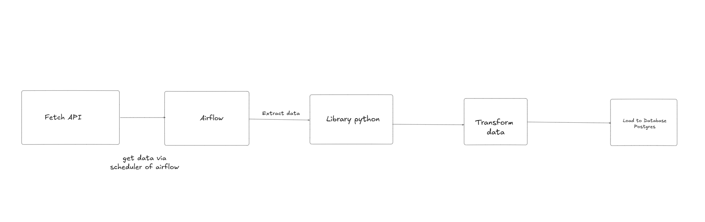

***NOTE*** WSL
Must implement 
docker exec -it airflow_webserver airflow db init   (must implement airflow init)

_**Xử lí khi login fail -> do user không tồn tại **_
docker exec -it airflow_webserver airflow users create \
    --username admin \
    --firstname Airflow \
    --lastname Admin \
    --role Admin \
    --email admin@example.com \
    --password admin

**Workflow**
1. USing requests for fetching API from openweather
2. Schedule the time for fetching data (Airflow)
3. Using Python library for extract data, transform, and load to Postgres( Pandas,..)
4. Load to database

**Tech stack**
Reason for choosing the techstack due to 
- data size : small
- tool for schedule/plan fetch data -> Airflow
- Python Library could handle the logic for ETL
- Postgres -> for batching process
- Docker compose -> running the container (Apache Airflow webserver, scheduler, postgres server , pgadmin)
